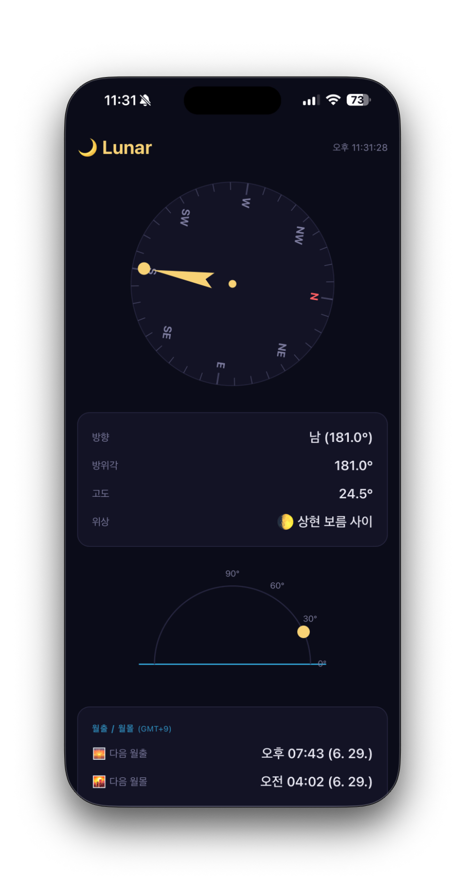
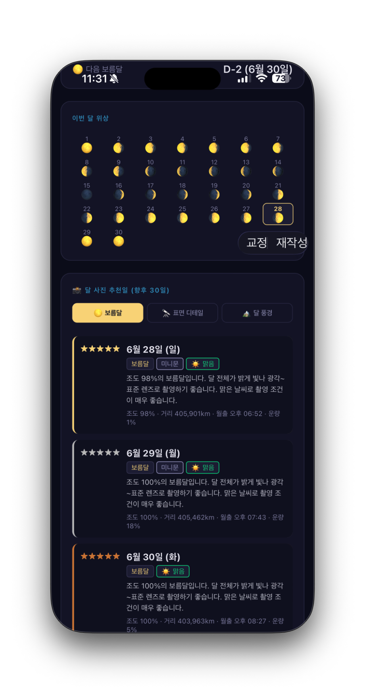
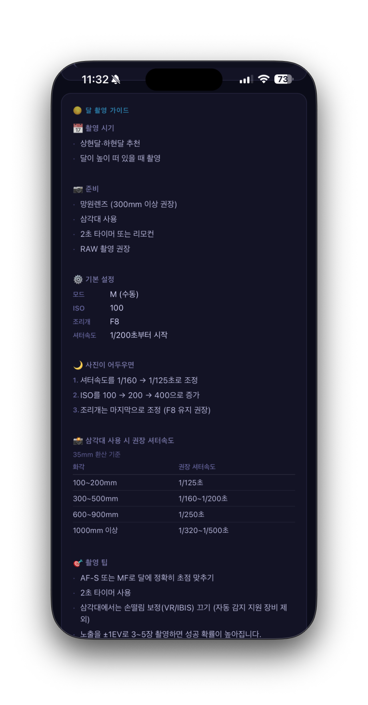

<div align="center">

# 🌙 Lunar

**달의 위치 · 위상 · 촬영 추천일을 실시간으로 확인하는 PWA**

Safari에서 홈 화면에 추가하면 앱처럼 사용할 수 있습니다.

[**→ 앱 열기**](https://flowlap.github.io/lunar/)

<br>

<table>
  <tr>
    <td align="center"></td>
    <td align="center"></td>
    <td align="center"></td>
  </tr>
  <tr>
    <td align="center"><sub>나침반 · 달 위치</sub></td>
    <td align="center"><sub>위상 달력 · 사진 추천일</sub></td>
    <td align="center"><sub>달 촬영 가이드</sub></td>
  </tr>
</table>

</div>

---

## 주요 기능

| | 기능 | 설명 |
|---|------|------|
| 🧭 | 나침반 | 달의 방향·방위각을 나침반 SVG로 실시간 표시. 기기 방향 센서 연동 시 북쪽 기준 자동 정렬 |
| 📐 | 고도 | 반원 그래프로 현재 달의 고도각 시각화 |
| 📈 | 일간 궤적 | 오늘 0–24시의 달 고도 변화를 꺾은선 그래프로 표시 |
| 🌅 | 월출·월몰 | 현재 시각 이후 다음 월출·월몰 시간 (GPS 기반 IANA 시간대 적용) |
| 🌕 | 위상 | 오늘의 달 위상 이름·이모지·조도(%) 표시 |
| 📅 | 위상 달력 | 이번 달 전체 날짜별 위상 이모지 달력 |
| 🔭 | 보름달 D-day | 다음 보름달까지 남은 일수 |
| 📏 | 거리 | 지구–달 현재 거리, 평균 대비 편차, 슈퍼문·미니문 배지 및 기준 안내 |
| ☀️ | 오늘의 조도·날씨 | 현재 조도(%)와 이번 저녁 날씨 예보를 함께 표시 |
| 📸 | 사진 추천일 | 향후 30일 중 촬영 목적별(보름달·표면 디테일·달 풍경) Top 5 추천 + 날씨·슈퍼문·미니문 반영 |
| 📷 | 촬영 가이드 | 초보자용 카메라 설정, 노출 조정 순서, 화각별 셔터속도 표 |

---

## 설치 방법 (iOS)

1. Safari에서 [https://flowlap.github.io/lunar/](https://flowlap.github.io/lunar/) 열기
2. 하단 공유 버튼 → **홈 화면에 추가**
3. 홈 화면의 Lunar 아이콘으로 실행

> GPS·나침반 권한은 최초 실행 시 묻습니다. 허용해야 모든 기능이 동작합니다.

---

## 기술 스택

### 프론트엔드

| 항목 | 내용 |
|------|------|
| 언어 | Vanilla JS (ES Modules), HTML5, CSS3 |
| 번들러 | 없음 — `<script type="module">` 직접 로드 |
| 스타일 | Pure CSS, CSS Variables, SVG DOM |
| 시각화 | SVG (나침반·고도호·궤적 그래프) — Canvas 미사용 |

### PWA

| 항목 | 내용 |
|------|------|
| 설치 | Safari → 홈 화면에 추가 (App Store 불필요) |
| Service Worker | `sw.js` — 앱 파일 네트워크 우선(HTTP 캐시 우회), CDN 캐시 우선 |
| 자동 업데이트 | 버전 변경 시 SW가 새 파일 프리캐시 → 구버전 삭제 → 페이지 자동 새로고침 |
| 오프라인 | 캐시된 파일로 오프라인 실행 가능 |

### 외부 라이브러리 & API

| 이름 | 역할 | 비용 |
|------|------|------|
| [SunCalc.js 1.9.0](https://github.com/mourner/suncalc) | 달·태양 위치, 위상, 월출몰 계산 | 무료 |
| [Open-Meteo](https://open-meteo.com) | 14일 시간별 운량(%) 날씨 예보 | 무료, 키 불필요 |
| [TimeAPI.io](https://timeapi.io) | GPS 좌표 → IANA 시간대 조회 | 무료 |

### 배포

| 항목 | 내용 |
|------|------|
| 호스팅 | GitHub Pages (`main` 브랜치 자동 배포) |
| HTTPS | GitHub Pages 기본 제공 (iOS GPS·나침반 권한 필수) |
| URL | `https://flowlap.github.io/lunar/` |

---

## 아키텍처

```
index.html
├── <script type="module"> src/app.js   ← 진입점·상태 관리
│   ├── src/moon.js          ← 천문 계산 (SunCalc 래퍼)
│   ├── src/compass.js       ← SVG 렌더링 (나침반·고도호·궤적)
│   ├── src/location.js      ← Geolocation API 래퍼
│   ├── src/orientation.js   ← DeviceOrientationEvent (나침반 센서)
│   └── src/weather.js       ← Open-Meteo API 래퍼
├── styles.css               ← 다크 스페이스 테마
├── manifest.json            ← PWA 메타데이터
└── sw.js                    ← Service Worker (캐시·자동 업데이트)
```

### 사진 추천일 점수 계산

```
향후 30일 각 날짜:

  ┌─ 천문 점수 (0–100) ─────────────────────────────────┐
  │  보름달 탭:    조도 95%+ → 100점                     │
  │  표면 탭:     조도 45–55%(터미네이터) → 100점        │
  │  달 풍경 탭:  보름달 ±3일(+60) + 월출≈일몰(+20)     │
  │               + 일몰 시 고도 0–10°(+20)              │
  └──────────────────────────────────────────────────────┘
          ↓ × 60%
  ┌─ 날씨 점수 (0–100) ─────────────────────────────────┐
  │  저녁 17–23시 최솟값(가장 맑은 시간) 기준           │
  │  운량 <20% → 100 / <40% → 80 / <60% → 50 / <80% → 20│
  └──────────────────────────────────────────────────────┘
          ↓ × 40%

  최종 점수 = 천문×0.6 + 날씨×0.4
  상위 5일 추출 → ★~★★★★★ 별점 표시
```

### Service Worker 캐시 전략

```
요청 유형                   전략
─────────────────────────────────────────────────────────
CDN (SunCalc.js)           캐시 우선  (URL 버전 고정)
앱 파일 (JS/CSS/HTML)       네트워크 우선, cache:'no-cache'로 HTTP 캐시 우회
외부 API (Open-Meteo 등)    네트워크만 (캐시 제외)
오프라인 fallback            SW 캐시에서 제공
```

---

## 파일 구조

```
lunar/
├── index.html          앱 셸 (DOM 구조, SunCalc CDN 로드)
├── styles.css          다크 스페이스 테마 (CSS Variables)
├── manifest.json       PWA 메타데이터 (아이콘, start_url)
├── sw.js               Service Worker (캐시·자동 업데이트)
├── docs/               README 스크린샷
├── public/
│   └── icons/          앱 아이콘 (SVG)
└── src/
    ├── app.js          진입점, 상태 관리, UI 렌더링
    ├── moon.js         천문 계산 (SunCalc.js 래퍼)
    ├── compass.js      SVG 시각화 (나침반·고도호·궤적)
    ├── location.js     Geolocation API
    ├── orientation.js  기기 방향 센서 (나침반)
    └── weather.js      Open-Meteo 날씨 예보
```

---

## 로컬 실행

HTTPS가 필요하므로 `file://` 직접 열기는 GPS·나침반이 동작하지 않습니다.

```bash
# HTTP (테스트용 — GPS 불가)
python3 -m http.server 8080

# HTTPS 터널
npx ngrok http 8080
```

---

## 버전 히스토리

| 버전 | 주요 변경 |
|------|-----------|
| v1.6 | 거리 기준 범례, 오늘의 조도·날씨 섹션, 추천일 미니문·슈퍼문 태그 |
| v1.5 | 달 촬영 가이드 추가 (촬영 시기·설정·셔터속도 표) |
| v1.4 | UI/UX 개선 (간격·색·위계), 데이터 출처 표시, SW 자동 새로고침 |
| v1.3 | Open-Meteo 날씨 예보 연동, 날씨 기반 추천일 재정렬 |
| v1.2 | 달 사진 추천일 (목적별 3탭·5성 평점·자연어 설명) |
| v1.1 | 월출·월몰, 달 궤적, 거리·슈퍼문, 위상 달력, 보름달 D-day |
| v1.0 | 기본 달 위치 (방위각·고도·나침반), GPS·PWA |
